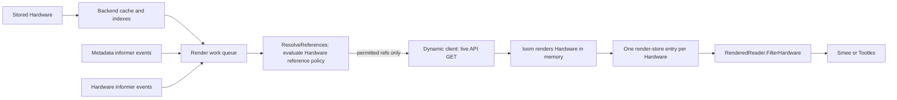
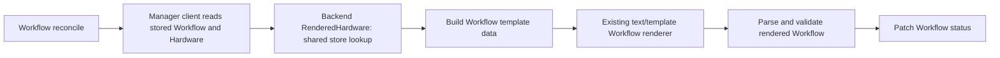

# Hardware Templating: Architecture and Data Flow

This explanation describes how the v1alpha1 Hardware reference policy and
renderer fit into Tinkerbell's Kubernetes clients, caches, and controllers. For
user tasks and configuration, see
[Configure Hardware Templating](HARDWARE_TEMPLATING.md) and
[Hardware References](REFERENCES.md).

## Design boundaries

The implementation has these boundaries:

1. Built-in template reference lookups use `Backend.ResolveReferences`, which
   evaluates policy before reading referenced objects.
2. Policy is evaluated for the Hardware and its declared reference, not for a
   downstream consumer.
3. Rendering transforms a Hardware and an already-resolved reference map. It
   does not fetch Kubernetes objects.
4. Rendered Hardware is served to read-only consumers and is never written back
   over the stored templates.
5. Request handlers look up pre-rendered results. They do not evaluate
   templates or fetch references.

## Code map

| Responsibility | Implementation |
| --- | --- |
| Configure the backend with policy rules and the feature flag | `cmd/tinkerbell/backend.go`, `cmd/tinkerbell/flag/global.go` |
| Construct and start the backend and render store | `pkg/backend/kube/kube.go` |
| Evaluate policy and resolve references | `pkg/backend/kube/reference.go` |
| Perform the private dynamic GET | `pkg/backend/kube/controller.go` |
| Convert Hardware and run loom | `pkg/backend/kube/render.go` |
| Queue renders and retain one result per Hardware | `pkg/backend/kube/render_store.go` |
| Serve rendered Hardware to Smee and Tootles | `pkg/backend/kube/rendered.go` |
| Resolve and render Hardware for Workflow templates | `tink/controller/controller.go`, `tink/controller/internal/workflow/reconciler.go` |
| Report render-store results as a Hardware condition | `hardware/internal/controller/rendered.go` |
| Prevent new direct dynamic-client imports | `.golangci.yml` (`depguard` rule `dynamic-client`) |

## Kubernetes read and write paths

The process has several clients with different jobs. Ordinary Kubernetes reads
are distinct from template reference reads, and reference policy does not
govern general object access.

| Path | Reads | Writes | Purpose |
| --- | --- | --- | --- |
| Kube backend | Its controller-runtime client reads Hardware through the backend cache. `FilterHardware` lists using registered indexes; `ReadHardware` gets by key. | Backend create, update, patch, and status operations use the client writer, which sends writes to the API server. | Serves normal Hardware data to Tink Server and, when templating is off, to Smee and Tootles. |
| Reference resolver | `dynamicRead` performs a live API GET for each permitted referenced object. It does not read that object from the controller-runtime cache. | None. | Supplies policy-approved data to Hardware and Workflow rendering. |
| Render store | Gets Hardware with the backend client. Watches Hardware and metadata-only referenced objects through informers; referenced-object events invalidate affected results. | None. | Rebuilds one shared rendered Hardware result away from request handlers. |
| Tink Controller manager | Its manager client reads Workflow and stored Hardware through a controller-runtime cache. For templating, it asks the backend for the shared rendered Hardware snapshot. | Patches Workflow status. The `setAllowPXE` helper separately patches stored Hardware `spec.interfaces` with an optimistic lock. | Reconciles Workflows, renders Workflow templates, and performs the existing PXE toggle. |
| Hardware Controller manager | Reads Hardware through its manager client, normally backed by the shared cache when cache scopes match. It reads render outcomes from the backend's in-memory store. | Applies only the `Rendered` Hardware status condition using server-side apply. | Reports the backend render result; it does not render or resolve references. |
| Rufio manager | Reads its managed objects through its manager client. When it borrows the backend cache, Secret reads are excluded from that cache and go to the API server. | Writes BMC-resource status and Hardware `status.attributes.outOfBand` through its client. | Performs BMC reconciliation; it is not part of Hardware template resolution. |

Controller-runtime clients normally split reads and writes: `Get` and `List`
are served from the configured cache, while writes go to the API server.
Exceptions in this design are intentional: reference data uses the dynamic
client for a live GET, and Rufio configures `DisableFor` on Secrets so its
credential reads do not cache Secret contents. When
`--backend-kube-namespace` is empty, the backend starts the shared cache and
the Tink, Rufio, and Hardware managers borrow it. With a namespace-scoped
backend, those managers keep their own caches because their scopes differ.

The reference policy is not applied to ordinary reads made by manager clients,
to Hardware CRUD, or to writes. It governs only reads of objects declared in
`Hardware.spec.references` that are made through `Backend.ResolveReferences`.
Kubernetes RBAC applies to every client using the process Service Account,
regardless of which code path issued the request.

### Hardware serving path

With templating enabled, the render store handles the Smee and Tootles path:

The stored Hardware read and the rendered result are separate objects. The
render store converts the stored object to an unstructured value, resolves
references, renders string leaves, and converts the result back to Hardware.
It stores one result by Hardware, never writes that result to the API server,
and serves the same rendered values to Smee and Tootles. A `RenderedReader`
first finds stored Hardware through the backend's indexed read, then returns
the prepared result. This is why the DHCP, iPXE, ISO, and metadata request paths
do not run templates or fetch references.

The render store registers informer handlers for Hardware and for
metadata-only referenced objects. Those handlers are invalidation signals,
not the source of reference contents. After an event, the worker resolves the
reference again through the policy-checked resolver, which performs the live
GET. This keeps reference data out of full-object informer caches while still
allowing changes to trigger a rerender.

If rendering fails after a prior success, Smee and Tootles continue to receive
the last successful shared result; a first-time failure leaves the Hardware
not ready. The Hardware Controller observes the render-store outcome and
applies the `Rendered` condition. It does not alter the rendered object or
retry the render itself.

### Workflow reconciliation path

Workflow rendering uses the same Hardware snapshot as Smee and Tootles:

The reconciler reads the stored Hardware through its manager client, then calls
`Backend.RenderedHardware` to look up the shared result by Hardware identity
and resource version. With templating disabled, that method returns the stored
Hardware unchanged. With templating enabled, it returns the same last-successful
snapshot used by Smee and Tootles; it does not resolve references or render
Hardware again. Workflow template data includes the rendered Hardware fields,
but removes `spec.references` and does not add a top-level `.references` map.
The Workflow template then executes, parses, and validates against that data.
The rendered Hardware is never written back to Kubernetes.

The reconciler watches `Workflow` objects; it does not watch Hardware
references or referenced objects. If the shared snapshot is not ready, a failed
initial Workflow render is retried. A successful initial render stores the
generated task data in Workflow status and advances the Workflow state. A later
referenced-object event does not rerender that Workflow: the controller ignores
terminal states and does not rebuild already-processed template output. A new
Workflow reads the latest successful shared snapshot. If a reference changes
while a render is pending or failing, it may read the previous successful
snapshot, matching what Smee and Tootles serve.

### Writes and ownership

Rendering is read-only with respect to source Hardware and referenced objects.
The separate write paths are intentional:

- Tink Server and other backend users create or update stored Hardware through
   the backend client. These writes are not reference-policy decisions.
- The Tink Controller's `setAllowPXE` changes the stored
   `spec.interfaces[].netboot.allowPXE` field with an optimistic-lock merge
   patch, preserving concurrent edits to unrelated fields.
- The Hardware Controller server-side-applies only the `Rendered` condition
   under its own field manager. This keeps condition ownership separate from
   other status writers.
- The Tink Controller patches Workflow status with render results; it does not
   write rendered Hardware back to the Hardware resource.
- Rufio writes its own status and inventory fields and does not consume
   rendered Hardware.

## Where failures appear

The resolver returns denied and unreadable-reference errors to its caller; it
does not create a policy-violation Kubernetes object. For Smee and Tootles, the
render store retains the latest render outcome in memory. When the Hardware
Controller is running, `RenderedReconciler` reflects that outcome in
`Hardware.status.conditions[type=Rendered]`. Its message includes the
error and whether a previous result is being served. Without that controller,
render failures are visible in backend logs, not persisted as a Hardware
condition. The same status apply writes `Hardware.status.lastRenderTime` for
each completed attempt, whether it succeeded or failed. This is the leader's
store completion time; it is distinct from the condition's `LastTransitionTime`
and does not acknowledge completion on other replicas.

For Workflow rendering, the reconciler writes
`Workflow.status.templateRendering` and the custom
`TemplateRenderedSuccess` condition. A failed initial render includes the
snapshot-read or Workflow-template error in the condition message; controller
logs also record the reconcile error. Reference-resolution failures are part of
the Hardware render outcome and are reported through the Hardware `Rendered`
condition when the Hardware Controller is running. Individual policy decisions
are logged at verbosity level 1, while render-store failures are logged as
errors.

## Startup and dependency wiring

`cmd/tinkerbell` creates the Kubernetes backend with the existing reference
allow/deny rules and the Hardware-templating flag. The backend constructs its
dynamic client into the unexported `dynamicClient` field. When templating is
enabled, it also constructs a render store whose resolver function is
`b.ResolveReferences`. `Backend.Start` starts the Kubernetes cluster cache and
render-store workers together; with templating disabled, there is no render
store to start.

The command wires the same backend as the Hardware reader:

- Smee and Tootles both receive `b.RenderedReader()`.
- The Tink Controller receives the backend as its `HardwareReader`.
- The Hardware controller receives the backend as its render-status source.

The Hardware controller only starts when both its enable option and Hardware
templating are enabled. It reports the render store's state; it does not perform
reference resolution or render Hardware itself.

## Reference resolution path

`Backend.ResolveReferences(ctx, hw)` iterates `hw.Spec.References`. For each
entry it builds the policy event from two inputs:

- `source`: the Hardware name and namespace;
- `reference`: the declared group, version, resource, namespace, and name.

The resolver evaluates deny and allow rules with Quamina. If no deny rules are
configured, it substitutes the implicit deny-all rule. A reference is rejected
when a deny rule matches and no allow rule matches. Thus an allow match takes
precedence; with explicit deny rules, a reference matching no deny rule is
permitted. This distinction is important to the policy's default-deny behavior.

Only after that decision does the resolver call the unexported
`Backend.dynamicRead`. That method uses the backend's unexported dynamic client
to fetch the named object. Denied and unreadable references are omitted from the
returned map and accumulated in the returned error; other references may still
be returned. The renderer uses missing-key errors, so a template that actually
uses an omitted reference fails instead of silently rendering an empty value.
An unused denied reference does not by itself fail a render.

The Tink Controller path is explicit in
`tink/controller/internal/workflow/reconciler.go`: it calls
`RenderedHardware` and builds Workflow template data from the shared result.
That data omits the Hardware's `spec.references`; no resolved-reference map is
passed to the Workflow template.

## Policy boundary and trusted code

There is no exported general-purpose dynamic read method on `Backend`:
`dynamicClient` and `dynamicRead` are package-private. The supported backend
operation for reference retrieval is `ResolveReferences`, and all built-in
reference call paths use it. In addition, `.golangci.yml`'s `dynamic-client`
depguard rule rejects imports of `k8s.io/client-go/dynamic` outside
`pkg/backend/kube`. The rule is a review/CI guard against adding an accidental
second read path.

Templates cannot fetch objects themselves. They receive a data map, and the
template function map is intentionally hermetic; it does not expose Kubernetes
clients or network lookup functions. A Hardware author can name a reference,
but cannot cause the backend to skip the policy check.

Code that constructs a separate Kubernetes client can also read anything
permitted by its Service Account. The Quamina rules are application policy, not
a Kubernetes authorization boundary. RBAC on the Service Account is the final
limit on objects the process can read.

The policy evaluator and render-store behavior are exercised by backend
reference and render-store tests. Workflow reconciler tests verify snapshot
reads and that both the resolved references and their Hardware declarations
are absent from Workflow template data. The depguard rule makes new imports of
the dynamic client outside the backend a lint failure.